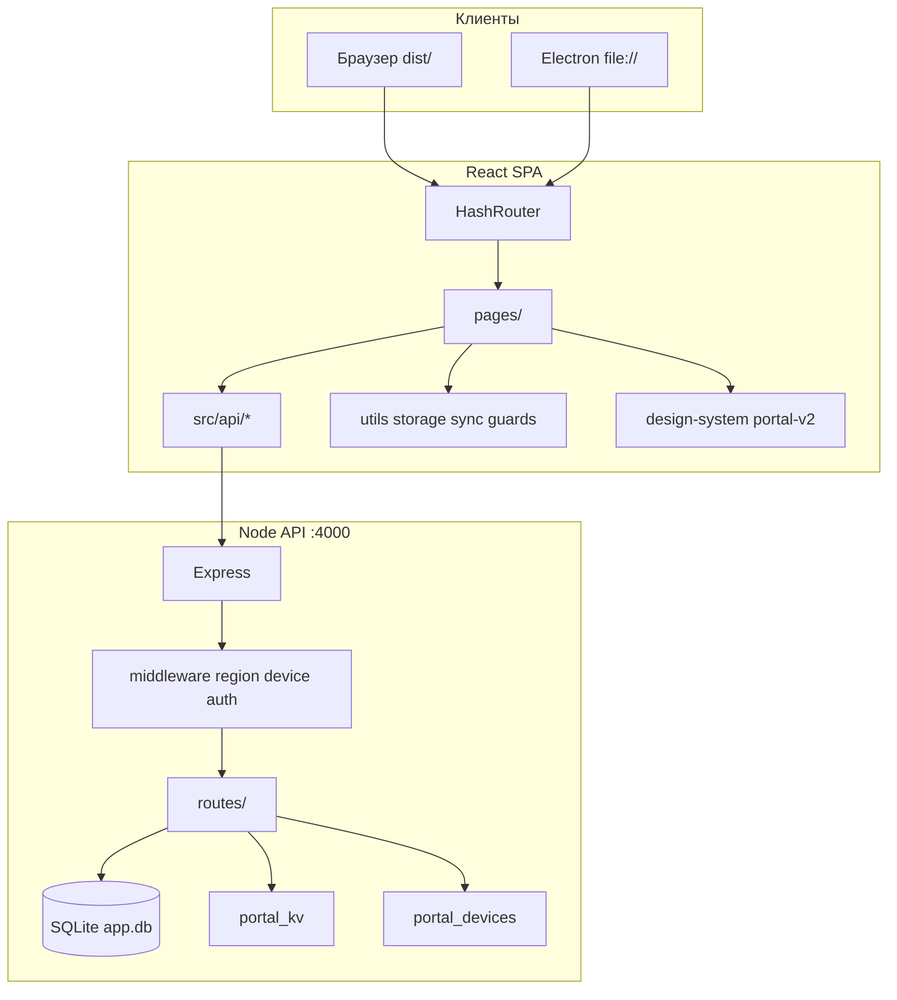

# Архитектура Трасса

## Обзор

## Фронтенд

### Маршрутизация

- Таблица: [ROUTES.md](./ROUTES.md), код: `src/routes/appRoutes.tsx`
- Lazy-load страниц в `App.tsx`
- Глобальные гейты в `App.tsx` + хуки `src/hooks/`

### Состояние

| Механизм | Примеры |
|----------|---------|
| localStorage / sessionStorage | профиль, тема, согласие ПДн |
| CustomEvent | `portal-privacy-consent`, `trassa-messenger-updated` |
| Server KV + poll | `PortalSyncProvider` → `/api/portal/version` |
| React useState | внутри страниц |

Глобального Redux/Zustand нет — при рефакторинге крупных страниц выносите логику в `src/hooks/`.

### API-клиенты (`src/api/`)

- `getApiBase()` — пустой URL в web (same-origin), duckdns для `file://`
- Ответы: `{ ok: true, ... } | { ok: false, error }`
- Auth: cookie + optional Bearer в sessionStorage
- Admin: заголовок `X-Trassa-Admin-Token`

### Дизайн

- Переключатель: `getPortalDesign()` → `legacy` | `v2`
- CSS: `src/design-system/portal-v2/` (~70 файлов)
- Спека: [design/PORTAL-DESIGN-V2-DS.md](./design/PORTAL-DESIGN-V2-DS.md)

## Бэкенд

### Точка входа

`server/src/index.ts` — CORS, helmet, middleware, роутеры.

### Роутеры

| Префикс | Файл | Назначение |
|---------|------|------------|
| `/api/auth` | `routes/auth.ts` | JWT, профиль |
| `/api/portal` | `routes/portal.ts` | KV, version, consent, region |
| `/api/devices` | `routes/devices.ts` | Устройства, SSE |
| `/api/admin` | `routes/admin.ts` | Админ-панель |
| `/api/tbot` | `routes/tbot.ts` | AI-ассистент |

### База данных

- `server/src/db.ts` — миграции через `ALTER TABLE`
- Путь: `server/data/app.db` или `TRASSA_DATA_DIR`
- WAL mode для конкурентных записей устройств

### Устройства и доступ

1. Клиент: `wirePortalEntryConsent()` → `POST /api/portal/consent`
2. Middleware `portalDeviceAccessMiddleware` — бан устройства
3. `portalRegionGateMiddleware` — только Россия (по IP)

## Web vs Desktop

| | Web | Electron |
|---|-----|----------|
| UI | `dist/` через nginx | `dist/` через `file://` |
| API | `/api` same-origin | Локальный или `electron-assets/api.json` |
| Сборка | `npm run build:web` | `npm run electron:build` |

Подробнее: [desktop/DESKTOP.md](./desktop/DESKTOP.md).

## Деплой

- Сайт: `scripts/deploy-portal-web.py`
- API: `scripts/remote-deploy-api-update.py`
- Шаблоны: `deploy/nginx-*.example.conf`

Подробнее: [deploy/DEPLOY.md](./deploy/DEPLOY.md).

## Известный технический долг

- Крупные файлы: `Page3AuthForm.tsx`, `AdminPresentationPanel.tsx`, `ContractorFormsView.tsx`
- Legacy-имена маршрутов `page3`–`page6`
- Два пути auth: серверный JWT + `localAuth.ts` (offline)
- `exhaustive-deps` в ESLint — часть предупреждений, цель — снизить до 0

Приоритет рефакторинга: разбивать по доменам (messenger, admin tables, map), не «всё сразу».

**Сделано:** `AdminDashboard.tsx` — чистый TSX-shell; панели в `components/admin/` с lazy-load; smoke + lint + server tests в CI. Мессенджер → `useMessengerState` + `components/messenger/*`. Таблицы → `useAdminTablesPanel` + секции в `components/admin/AdminTables*`. Page3 → shell ~185 строк; `usePage3Auth` + `components/page3/*`. Т-бот → `useTbotChat` + `components/tbot/*`, shell `AiChatBubble.tsx` ~86 строк.
